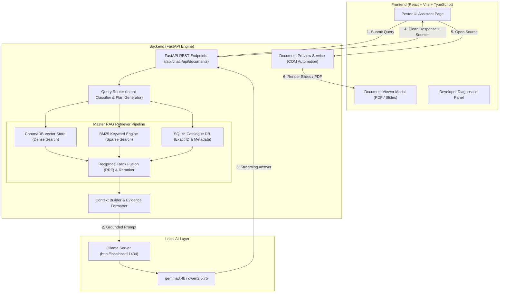

# NEXUS — Master RAG & Document Intelligence Platform

<div align="center">


<p align="center">
  <b>Enterprise-Grade Retrieval-Augmented Generation Platform for Complex Document Collections</b><br/>
  Powered by Local Ollama Models, Hybrid Vector-BM25 Search, COM Document Rendering, and Multi-Format Intelligence.
</p>

</div>

---

## 📖 Table of Contents

- [Overview](#-overview)
- [Key Features & Architectural Highlights](#-key-features--architectural-highlights)
- [System Architecture](#-system-architecture)
- [Repository Structure](#-repository-structure)
- [Prerequisites](#-prerequisites)
- [Local Machine Installation & Setup](#-local-machine-installation--setup)
  - [1. Ollama Local LLM Setup](#1-ollama-local-llm-setup)
  - [2. Backend Setup (FastAPI & RAG Engine)](#2-backend-setup-fastapi--rag-engine)
  - [3. Frontend Setup (React & Vite)](#3-frontend-setup-react--vite)
- [Document Preview Pipeline (PPTX / DOCX / PDF)](#-document-preview-pipeline-pptx--docx--pdf)
- [API Reference & System Endpoints](#-api-reference--system-endpoints)
- [Developer Diagnostics & Technical Signals](#-developer-diagnostics--technical-signals)
- [License](#-license)

---

## 🌟 Overview

**NEXUS** is an enterprise document intelligence and Retrieval-Augmented Generation (RAG) assistant designed for high-accuracy factual question answering across large, multi-format document repositories. 

Unlike traditional simplistic vector-RAG systems, NEXUS features a **Master RAG Retriever** pipeline that unifies semantic dense vector search, sparse BM25 keyword matching, structured record extraction, and exact identifier query routing. It runs 100% locally with private LLM inference via **Ollama**, ensuring sensitive data never leaves your infrastructure.

---

## ✨ Key Features & Architectural Highlights

- 🔍 **Multi-Strategy Hybrid Retrieval**: Merges dense semantic embeddings (ChromaDB) with BM25 keyword search using **Reciprocal Rank Fusion (RRF)** to eliminate retrieval blind spots.
- 🎯 **Query Router & Intent Classification**: Automatically classifies user queries into `EXACT_IDENTIFIER`, `PAGE_LOOKUP`, `SUMMARY`, or `SEMANTIC_SEARCH` for optimized search plans.
- 🖼️ **Native PPTX / DOCX / PDF Preview Engine**: Zero automatic browser downloads! High-fidelity inline slide rendering using Windows COM automation (PowerPoint & Word) with slide-to-chunk navigation.
- 🏷️ **Deduplicated Source Citation**: Automatically groups retrieved chunks by document ID, presenting single clean source cards with merged page/slide ranges (e.g., `Slides: 1, 2, 3, 7, 14`).
- 🧹 **Clean Answer Grounding**: Formats response text cleanly without intrusive internal relevance percentages or inline evidence tags.
- 💻 **100% Local Privacy via Ollama**: Native integration with local models like `gemma3:4b` or `qwen2.5:7b` via Ollama's HTTP server.
- ⚙️ **Developer Diagnostics Panel**: Collapsible drawer providing internal retrieval stats, dense similarity scores, query latency, and reranking metrics.
- 🎨 **Swiss Neubrutalist Poster UI**: Aesthetic high-contrast typography, glassmorphism, responsive state persistence, and dark mode accents.

---

## 🏗️ System Architecture



---

## 📁 Repository Structure

```
nexus-rag/
├── backend/
│   ├── app/
│   │   ├── main.py                    # FastAPI Application Entry & CORS Setup
│   │   ├── api/                       # API Routes & Endpoints
│   │   │   ├── routes_chat.py         # /api/chat & /api/conversations
│   │   │   ├── routes_documents.py    # /api/documents (Upload, Delete, Preview)
│   │   │   ├── routes_health.py       # System Node Health Check
│   │   │   ├── routes_models.py       # Ollama Model Discovery
│   │   │   └── routes_stats.py        # Analytics & System Statistics
│   │   ├── rag/                       # RAG Pipeline Core
│   │   │   ├── pipeline.py            # Main RAG Execution & Answer Cleaning
│   │   │   ├── query_router.py        # Query Intent Classification
│   │   │   ├── hybrid_search.py       # Vector + BM25 + Exact RRF Search
│   │   │   ├── context_builder.py     # Prompt Context Assembly
│   │   │   ├── prompts.py             # Grounded System Prompt Templates
│   │   │   ├── retriever.py           # ChromaDB Vector Store Wrapper
│   │   │   └── llm.py                 # Ollama & Local Provider Adapters
│   │   ├── services/                  # Specialized Engine Services
│   │   │   ├── preview_service.py     # PPTX/DOCX COM Preview Converter
│   │   │   ├── processor.py           # Document Ingestion & Chunking
│   │   │   └── pdf.py                 # PDF Parser & OCR Extraction
│   │   ├── db/                        # SQLite Storage & Migrations
│   │   └── models/                    # Pydantic Request & Response Schemas
│   ├── dataset/                       # Auto-indexed Knowledge Base Directory
│   ├── previews/                      # Generated PPTX/DOCX Slide Preview Cache
│   ├── requirements.txt               # Python Dependencies
│   └── .env.example                   # Environment Configuration Template
├── frontend/
│   ├── src/
│   │   ├── pages/
│   │   │   ├── AssistantPage.tsx      # RAG Chat Interface & Sources UI
│   │   │   ├── KnowledgeBasePage.tsx  # Document Ingestion & Table View
│   │   │   ├── AnalyticsPage.tsx      # RAG Query Analytics & Metrics
│   │   │   └── SettingsPage.tsx       # System & Model Settings
│   │   ├── components/
│   │   │   ├── DocumentViewerModal.tsx# Visual Slide & PDF Document Viewer
│   │   │   └── Sidebar.tsx            # Poster UI Navigation Bar
│   │   ├── services/                  # Axios API Service Layer
│   │   └── types/                     # TypeScript API Interfaces
│   ├── index.css                      # Tailwind CSS & Swiss Aesthetics
│   ├── package.json                   # Frontend Dependencies
│   └── vite.config.ts                 # Vite Build & Proxy Configuration
└── README.md                          # Master Enterprise Documentation
```

---

## 🛠️ Prerequisites

Before installing NEXUS, ensure your system meets the following requirements:

- **Operating System**: Windows 10/11 (Recommended for MS Office PPTX/DOCX COM Preview automation) or Linux/macOS.
- **Python**: `3.10.x` or `3.11.x`
- **Node.js**: `v18.0.0` or higher (with `npm`)
- **Ollama**: Installed locally ([Download Ollama](https://ollama.com/download))
- **Microsoft Office** (Optional, for native PPTX/DOCX high-resolution slide rendering via `pywin32`)

---

## 💻 Local Machine Installation & Setup

Follow these step-by-step instructions to get NEXUS running locally.

### 1. Ollama Local LLM Setup

1. **Install Ollama**: Download and install Ollama for your operating system from [ollama.com](https://ollama.com/).
2. **Start the Ollama Server**:
   ```bash
   ollama serve
   ```
   *(By default, Ollama runs at `http://localhost:11434`)*

3. **Pull Your Preferred Model**:
   Open a terminal and download your target LLM (e.g., `gemma3:4b` or `qwen2.5:7b`):
   ```bash
   ollama pull gemma3:4b
   ```
   *(Or for Qwen)*:
   ```bash
   ollama pull qwen2.5:7b
   ```

---

### 2. Backend Setup (FastAPI & RAG Engine)

1. **Navigate to the Backend Directory**:
   ```bash
   cd backend
   ```

2. **Create and Activate a Virtual Environment**:
   - **Windows (PowerShell)**:
     ```powershell
     python -m venv venv
     .\venv\Scripts\Activate.ps1
     ```
   - **Linux / macOS**:
     ```bash
     python3 -m venv venv
     source venv/bin/activate
     ```

3. **Install Dependencies**:
   ```bash
   pip install -r requirements.txt
   ```

4. **Configure Environment Variables**:
   Copy `.env.example` to `.env`:
   ```bash
   cp .env.example .env
   ```
   Verify your `.env` contains the following settings:
   ```env
   PORT=8000
   OLLAMA_BASE_URL=http://localhost:11434
   DEFAULT_LLM_MODEL=local_qwen
   LMSTUDIO_MODEL=gemma3:4b
   CHROMA_PERSIST_DIRECTORY=./chroma_db
   DATASET_DIRECTORY=./dataset
   PREVIEW_DIRECTORY=./previews
   ```

5. **Start the FastAPI Backend Server**:
   ```bash
   uvicorn app.main:app --host 0.0.0.0 --port 8000 --reload
   ```
   The backend will start at `http://localhost:8000`. You can test health at `http://localhost:8000/api/health`.

---

### 3. Frontend Setup (React & Vite)

1. **Navigate to the Frontend Directory**:
   ```bash
   cd ../frontend
   ```

2. **Install Node Dependencies**:
   ```bash
   npm install
   ```

3. **Configure Frontend Environment**:
   Copy `.env.example` to `.env`:
   ```bash
   cp .env.example .env
   ```
   Ensure `.env` contains:
   ```env
   VITE_API_BASE_URL=http://localhost:8000
   ```

4. **Start the Frontend Development Server**:
   ```bash
   npm run dev
   ```
   Open your browser and navigate to `http://localhost:5173`.

---

## 🖼️ Document Preview Pipeline (PPTX / DOCX / PDF)

NEXUS contains a document preview conversion pipeline (`preview_service.py`) that prevents automatic file downloads in Chrome and enables visual slide navigation.

### How It Works:
1. **PDF Files**: Rendered inline using PyMuPDF (`fitz`) and standard browser PDF viewers with `Content-Disposition: inline`.
2. **PPTX / DOCX Files**:
   - On Windows, NEXUS calls MS Office COM automation (`pywin32` / `comtypes`) in a thread-safe worker to render high-resolution PDF pages and individual slide PNG images into `backend/previews/<doc_id>/`.
   - On Linux/macOS, it uses headless LibreOffice or Pillow fallback rendering.
3. **Slide Navigation**: When clicking **"Open Source"** on a source card, the frontend `DocumentViewerModal.tsx` fetches the target slide image `/api/documents/{id}/preview/slide/{page}` directly!

---

## 🔌 API Reference & System Endpoints

### 💬 Chat & RAG Execution
| Method | Endpoint | Description |
| :--- | :--- | :--- |
| `POST` | `/api/chat` | Main query endpoint. Accepts `message`, `model`, `conversation_id`, and `use_knowledge_base`. Returns clean `answer`, deduplicated `sources`, and `retrieval` stats. |
| `POST` | `/api/chat/stream` | Server-Sent Events (SSE) endpoint for real-time answer streaming. |
| `GET` | `/api/conversations` | Lists all active user chat sessions. |
| `GET` | `/api/conversations/{id}` | Retrieves message history for a specific conversation session. |

### 📄 Document Intelligence & Previews
| Method | Endpoint | Description |
| :--- | :--- | :--- |
| `GET` | `/api/documents` | Lists all indexed documents in the Knowledge Base. |
| `POST` | `/api/documents/upload` | Uploads a new PDF, PPTX, DOCX, XLSX, or Image file for indexing. |
| `GET` | `/api/documents/{id}/preview` | Returns preview metadata (page count, cached slide status). |
| `GET` | `/api/documents/{id}/preview/pdf` | Serves PDF binary stream inline (`Content-Disposition: inline`). |
| `GET` | `/api/documents/{id}/preview/slide/{page}` | Returns PNG image of a specific slide or page. |
| `GET` | `/api/documents/{id}/download` | Triggers explicit download of the original file (`attachment`). |

### ⚙️ System & Health
| Method | Endpoint | Description |
| :--- | :--- | :--- |
| `GET` | `/api/health` | Node health status for Backend, ChromaDB, Embeddings, and Ollama. |
| `GET` | `/api/models` | Discovers available local Ollama models. |
| `GET` | `/api/stats` | Returns RAG performance statistics, query counts, and dataset metrics. |

---

## 📊 Developer Diagnostics & Technical Signals

To maintain a clean user experience while supporting deep inspection, NEXUS provides a hidden **Developer Diagnostics** panel under every AI response.

Click **`DEVELOPER DIAGNOSTICS`** in the assistant chat to inspect:
- **MODEL**: Active LLM engine (e.g. `gemma3:4b`).
- **RESPONSE TIME**: End-to-end processing latency in milliseconds.
- **ANSWER TYPE**: Retrieval mode (`DATASET`, `GENERAL_KNOWLEDGE`, `EXACT_IDENTIFIER`).
- **CHUNKS (SEM/KEY/RERANK)**: Number of candidate chunks retrieved across semantic search, BM25 keyword search, and RRF reranking.
- **INTERNAL DENSE SCORE**: Top cosine similarity score calculated by ChromaDB.

---

## 📜 License

NEXUS Enterprise RAG is released under the [MIT License](LICENSE).
